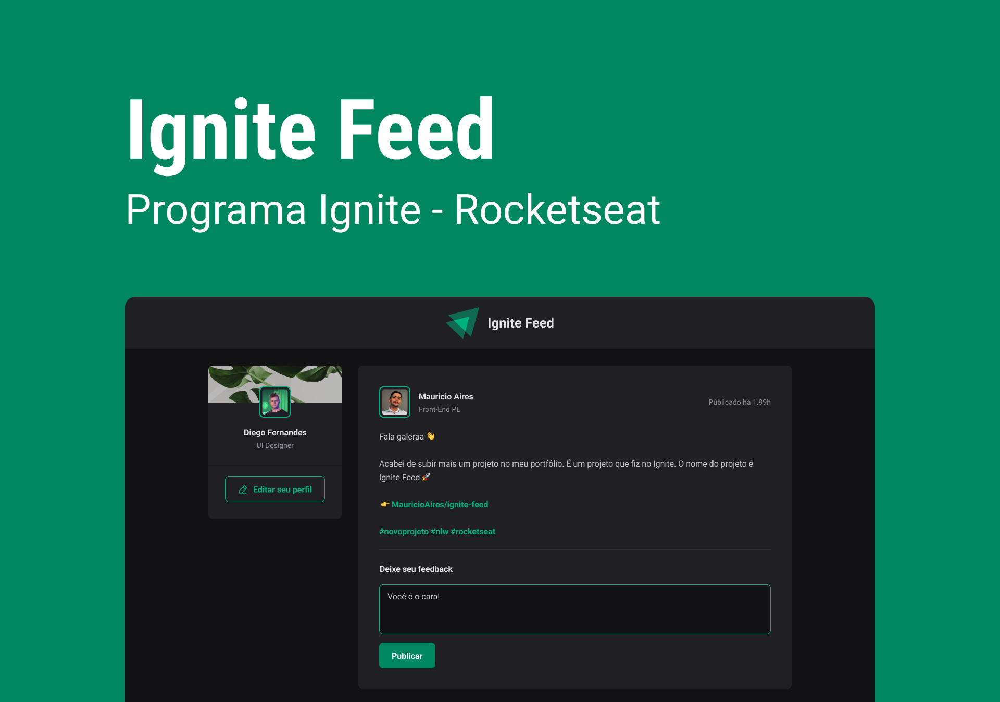

<p align="center">

</p>

---

<p align="center">
  <a href="#dart-sobre">Sobre</a> &#xa0; | &#xa0; 
  <a href="#rocket-tecnologias">Tecnologias</a> &#xa0; | &#xa0;
  <a href="#white_check_mark-requerimentos">Requerimentos</a> &#xa0; | &#xa0;
  <a href="#checkered_flag-começando">Começando</a> &#xa0; &#xa0; | &#xa0;
  <a href="#framed_picture-imagens">Imagens</a> &#xa0; &#xa0;
</p>

<br>

### Sobre

O Ignite Feed é um projeto que simula um feed de redes sociais, onde é possível fazer comentários nos posts, aplaudir e apagar um comentário.

Nessa aplicação não foi utilizado **typescript**, adicionar typescript em uma aplicação já desenvolvida é mais complexo do que iniciar um novo projeto, dessa forma irei replicar essa aplicação mas agora com typescript :)

### Tecnologias

As seguintes tecnologias foram utilizadas no projeto:

- [ReactJs](https://reactjs.org/)

### Requerimentos

- [Node](https://nodejs.org/en/)
- [Yarn](https://yarnpkg.com/lang/en/)

### Começando

```bash
# Clone this project
$ git clone https://github.com/MauricioAires/ignite-feed

# Access
$ cd ignite-feed

# Install dependencies
$ yarn install

# Run the project
$ yarn dev
```
